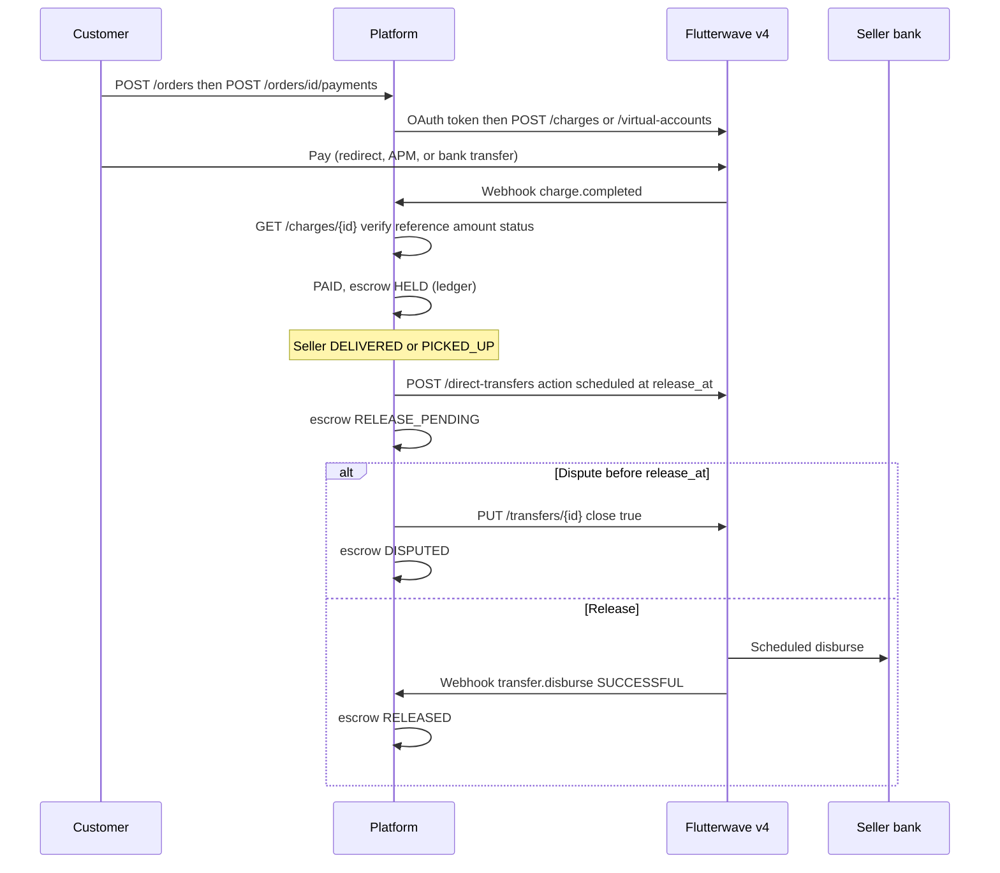

# Flutterwave Escrow — Phase 0 Spike (v4)

**Date:** 16 August 2026  
**Status:** Complete — desk research, sandbox E2E, stock strategy decided  
**Supersedes:** [`PAYSTACK_ESCROW_PHASE_0.md`](PAYSTACK_ESCROW_PHASE_0.md) — Paystack manual subaccount settlement has no public release API

## Why Flutterwave v4

Paystack subaccount + `settlement_schedule: manual` cannot be released programmatically. Flutterwave **v4** provides OAuth credentials (Client ID / Client Secret — what the dashboard shows today), programmatic collections, and programmatic payouts.

| Capability | v4 API | Escrow role |
| ---------- | ------ | ----------- |
| **OAuth 2.0** | Token endpoint + Bearer access token | All server calls |
| **Charges** | `POST /charges` (+ customers, payment methods) | Customer checkout |
| **Orchestrator** | `POST /orchestration/direct-charges` | Faster one-shot charges (APM / card) |
| **Virtual accounts** | `POST /virtual-accounts` | Optional bank-transfer checkout |
| **Direct transfers** | `POST /direct-transfers` | Seller payout (`instant`, `deferred`, `scheduled`) |
| **Transfer recipients** | `POST /transfers/recipients` | Reusable seller bank details |

**Not used:** v3-only paths (`/v3/payments`, `/v3/payout-subaccounts`, `/v3/subaccounts`, legacy Inline with public key). v4 replaces these.

Docs: [Authentication](https://developer.flutterwave.com/docs/authentication), [General payment flow](https://developer.flutterwave.com/docs/main-payment-flow), [Direct transfers](https://developer.flutterwave.com/docs/direct-transfer-flow), [Webhooks](https://developer.flutterwave.com/docs/webhooks).

---

## Architecture (v4 programmatic escrow)

Funds collect into the **platform Flutterwave balance**. Escrow hold is tracked in our DB. Seller payout is a **v4 bank transfer** triggered after fulfillment + dispute window.



**Platform fee** stays on the platform balance; scheduled/instant transfer sends only `seller_net_amount`.

**Alternative release path:** create a **deferred** transfer at fulfillment, then `PUT /transfers/{id}` with `action: instant` when `release_at` passes (if scheduled transfers are unavailable on the account).

---

## Authentication

All v4 API calls use a short-lived OAuth access token (10 minutes).

```
POST https://idp.flutterwave.com/realms/flutterwave/protocol/openid-connect/token
Content-Type: application/x-www-form-urlencoded

client_id={FLUTTERWAVE_CLIENT_ID}
client_secret={FLUTTERWAVE_CLIENT_SECRET}
grant_type=client_credentials
```

Use `Authorization: Bearer {access_token}` on API requests. Refresh ~1 minute before expiry. **Never** expose client secret or tokens to the frontend.

### Base URLs

| Environment | Base URL |
| ----------- | -------- |
| Sandbox | `https://developersandbox-api.flutterwave.com` |
| Production | `https://f4bexperience.flutterwave.com` |

Same OAuth token endpoint for both; credentials differ per environment.

### Request headers (mutating calls)

- `Authorization: Bearer {access_token}`
- `Content-Type: application/json`
- `X-Idempotency-Key: {uuid}` — required for idempotent creates (charges, transfers, recipients)
- `X-Trace-Id: {uuid}` — optional tracing

---

## Confirmed APIs

### 1. Seller payout onboarding (transfer recipient)

Create once per seller bank account; store returned recipient id.

```
POST {BASE_URL}/transfers/recipients
Authorization: Bearer {access_token}
X-Idempotency-Key: {uuid}
```

```json
{
  "type": "bank_ngn",
  "bank": {
    "account_number": "0690000031",
    "code": "044"
  }
}
```

| Our column | Flutterwave field |
| ---------- | ----------------- |
| `provider_recipient_id` | `data.id` (`rcb_...`) |

Resolve account name via `POST /banks/account-resolve` during seller onboarding:

```json
{
  "currency": "NGN",
  "account": { "code": "044", "number": "0690000031" }
}
```

### 2. Customer payment — general charge flow (MVP)

1. `POST /customers` (email required)
2. `POST /payment-methods` (card requires client-side encryption — see Encryption below)
3. `POST /charges`

```
POST {BASE_URL}/charges
```

```json
{
  "reference": "PAY-abc123",
  "amount": 10000,
  "currency": "NGN",
  "customer_id": "cus_...",
  "payment_method_id": "pmd_...",
  "redirect_url": "https://app.example.com/orders/{id}",
  "meta": {
    "order_id": "...",
    "payment_id": "..."
  }
}
```

Handle `data.next_action` (`redirect_url`, `payment_instruction`, `requires_pin`, etc.) on frontend. Charge id prefix: `chg_...`.

**Orchestrator shortcut:** `POST /orchestration/direct-charges` combines customer + payment method + charge for one-off checkout ([orchestrator flow](https://developer.flutterwave.com/docs/payment-orchestrator-flow)).

### 3. Customer payment — dynamic virtual account (optional)

```
POST {BASE_URL}/virtual-accounts
```

```json
{
  "reference": "PAY-abc123",
  "customer_id": "cus_...",
  "amount": 10000,
  "currency": "NGN",
  "bank_code": "090567",
  "account_type": "dynamic",
  "expiry": 3600,
  "narration": "Order payment"
}
```

Returns `account_number`, `account_bank_name`, `account_expiration_datetime`. Same `reference` links webhook to payment row.

### 4. Verify payment

```
GET {BASE_URL}/charges/{charge_id}
```

Confirm: `data.status === "succeeded"`, `data.amount`, `data.currency`, `data.reference`.

Store `data.id` as `provider_charge_id`. Sum fee fields from `data.fees[]` into `fee_amount`.

### 5. Escrow hold (application ledger)

After verified charge, mark payment `PAID` and escrow `HELD`. **No Flutterwave wallet move** at this step — funds remain on platform balance until payout.

### 6. Escrow release — scheduled bank transfer (preferred)

When seller reaches `DELIVERED` / `PICKED_UP`, schedule payout for `release_at = now + ESCROW_RELEASE_DAYS`:

```
POST {BASE_URL}/direct-transfers
X-Idempotency-Key: {uuid}
```

```json
{
  "action": "scheduled",
  "type": "bank",
  "reference": "RELEASE-{escrow_hold.id}",
  "narration": "Order payout {order_id}",
  "disburse_option": {
    "date_time": "2026-08-23 12:00:00",
    "timezone": "UTC"
  },
  "payment_instruction": {
    "source_currency": "NGN",
    "destination_currency": "NGN",
    "amount": {
      "applies_to": "destination_currency",
      "value": 9500
    },
    "recipient": {
      "bank": {
        "account_number": "0690000040",
        "code": "044"
      }
    }
  }
}
```

Or reference saved recipient via general transfer flow (`recipient_id` in `POST /transfers`).

Confirm terminal state on webhook `transfer.disburse` with `data.status === "SUCCESSFUL"`. Store `data.id` as `provider_transfer_id`.

### 7. Escrow release — deferred + instant (alternative)

At fulfillment, create deferred transfer; release job calls:

```
PUT {BASE_URL}/transfers/{transfer_id}
{ "action": "instant" }
```

Cancel before release:

```
PUT {BASE_URL}/transfers/{transfer_id}
{ "close": true }
```

Response: `data.status` → `CANCELLED` (verified sandbox 16 Aug 2026). Do **not** use `{ "action": "close" }`.

### 8. Refund before release

```
POST {BASE_URL}/refunds
```

```json
{
  "charge_id": "chg_...",
  "amount": 10000,
  "reason": "requested_by_customer"
}
```

Valid `reason` values: `duplicate`, `fraudulent`, `requested_by_customer`, `expired_uncaptured_charge`. Charge must be **`succeeded`** (pending charges return `REFUND_CREATION_FAILED`).

If a scheduled/deferred payout exists, cancel it first. Restore stock per chosen strategy.

### 9. Webhooks

**Route:** `POST /webhooks/flutterwave`

| Event | Action |
| ----- | ------ |
| `charge.completed` | Verify charge + mark PAID + escrow HELD |
| `transfer.disburse` | Match `reference` prefix `RELEASE-` → update escrow |
| Refund events | Match charge id → update payment/escrow |

**Verification** ([webhooks doc](https://developer.flutterwave.com/docs/webhooks)):

- `flutterwave-signature` = base64(HMAC-SHA256(`FLUTTERWAVE_WEBHOOK_SECRET`, raw_body))

**Idempotency:** store `(type, data.id, data.status)` or webhook `id` in `payment_events`.

---

## Card encryption (frontend)

Direct card charge requires encrypting PAN/CVV/expiry with `FLUTTERWAVE_ENCRYPTION_KEY` and a 12-character nonce per request ([encryption doc](https://developer.flutterwave.com/docs/encryption)). Server never sees raw card data.

For redirect-based methods (3DS, some APMs), follow `next_action.redirect_url` — no encryption on server.

---

## Naming (unchanged from plan)

- Plain names on our tables: `payments.reference`, `payments.amount`
- Provider-origin: `provider_*` (`provider_charge_id`, `provider_recipient_id`, `provider_transfer_id`)
- No `flutterwave_*` column names

---

## Economics

- Amounts in v4 charge/transfer APIs: NGN major units (numbers)
- Store amounts in DB as `Decimal` (existing order pattern)
- Transfer fees + CBN stamp duty on large NGN transfers — model in platform fee / seller economics

---

## Config (env)

See [`print/.env.example`](../.env.example).

| Variable | Purpose |
| -------- | ------- |
| `FLUTTERWAVE_CLIENT_ID` | OAuth client id (dashboard) |
| `FLUTTERWAVE_CLIENT_SECRET` | OAuth client secret (server only) |
| `FLUTTERWAVE_ENCRYPTION_KEY` | Client-side card field encryption |
| `FLUTTERWAVE_WEBHOOK_SECRET` | Webhook HMAC secret (Settings → Webhooks) |
| `FLUTTERWAVE_API_BASE_URL` | Sandbox or production API base (optional override) |
| `ESCROW_RELEASE_DAYS` | Days after fulfillment before payout |
| `PLATFORM_FEE_PERCENT` | Platform share on each paid order |

Frontend (when card encryption is implemented): `NEXT_PUBLIC_FLUTTERWAVE_ENCRYPTION_KEY` — or fetch encryption params from a backend endpoint that does not expose client secret.

---

## Prerequisites (Flutterwave dashboard)

- [x] Sandbox Client ID + Client Secret
- [x] Transfers enabled (sandbox payouts verified)
- [ ] Webhook URL + secret hash configured (`FLUTTERWAVE_WEBHOOK_SECRET` in `.env`)
- [ ] NGN collections + payouts approved for production

---

## Phase 0 exit criteria

- [x] v4 escrow flow mapped (platform balance hold + scheduled/deferred payout)
- [x] v3 PSA path explicitly excluded
- [x] OAuth, webhooks, verify flow documented
- [x] Sandbox E2E: OAuth → customer → recipient → transfers → charges → refunds (16 Aug 2026)
- [x] Stock strategy chosen — **auto-refund on oversell** (see below)
- [ ] Live webhook delivery test — blocked until `FLUTTERWAVE_WEBHOOK_SECRET` + public URL configured in dashboard

---

## Stock strategy (Phase 1 decision)

**Chosen: Option B — auto-refund on oversell** (no reservation table for MVP).

| Path | Stock behavior |
| ---- | -------------- |
| **Fulfillment-only** (`payment_status = NONE`) | Unchanged — deduct on `POST /orders` (current code) |
| **Paid checkout** (`payment_status = PENDING`) | Soft-check stock at order create; **do not deduct** |
| **`charge.completed` webhook** | Atomic `deduct_stock`; if fail → `POST /refunds` (`requested_by_customer`) + cancel order |
| **Cancel / refund** | `restore_stock` via existing `_restore_stock_for_order` |

**Why not reservation:** avoids TTL sweeper, reservation rows, and release-on-expiry jobs for MVP. Trade-off: brief oversell window between two concurrent checkouts — second payer gets auto-refund, not a hard block at order create.

**Webhook rule:** always return HTTP 200 after persisting the event; never 422 from webhook handler.

---

## Sandbox E2E results (16 Aug 2026)

| Step | Result | Notes |
| ---- | ------ | ----- |
| OAuth token | ✅ | 600s TTL; same endpoint for sandbox credentials |
| `POST /customers` | ✅ | `cus_...` returned |
| `POST /transfers/recipients` | ✅ | `rcb_...`; resolves test account name |
| `POST /direct-transfers` scheduled | ✅ | `trf_...`; sandbox marks `SUCCESSFUL` immediately |
| `GET /transfers/{id}` | ✅ | Fee ₦95 on ₦9,500 payout; VAT in `debit_information` |
| `POST /virtual-accounts` dynamic | ✅ | Account number + 1h expiry; `reference` links to payment |
| `POST /orchestration/direct-charges` OPay | ✅ | Requires **https** `redirect_url` (localhost rejected) |
| `GET /charges/{id}` | ✅ | Pending until customer completes redirect flow |
| Deferred transfer + `PUT action:instant` | ⚠️ | Sandbox auto-completes deferred; PUT returns `INVALID_TRANSFER_STATUS` |
| `POST /refunds` full + partial | ✅ | Requires `succeeded` charge; reason enum validated |
| `GET /refunds/{id}` + list | ✅ | List requires `size >= 10` |
| Refund on pending charge | ✅ rejected | `REFUND_CREATION_FAILED`: pending transactions |
| `GET /wallets/balances/NGN` | ✅ | `available_balance` returned |
| `POST /banks/account-resolve` | ✅ | Returns `account_name` for test account |
| `PUT /transfers/{id}` `{close:true}` | ✅ | Scheduled transfer → `CANCELLED` (dispute/cancel path) |
| `POST /resend-webhook` | ⚠️ | Requires webhook URL in dashboard (`WEBHOOK_ENDPOINT_NOT_FOUND`) |
| Webhook HMAC algorithm | ✅ | `base64(hmac-sha256(secret, raw_body))` verified locally |

**Implementation notes from spike:**

- Use `https://` redirect URLs in checkout (not `http://localhost`).
- Scheduled transfers work for escrow release; validate `transfer.disburse` webhook in Phase 1 once dashboard URL is set.
- Cancel escrow payout: `PUT /transfers/{id}` with `{ "close": true }` before `release_at`.
- Deferred + instant completion path needs re-validation if production honors `NEW` state longer than sandbox.
- Add `FLUTTERWAVE_WEBHOOK_SECRET` to `.env` and configure webhook URL in Flutterwave dashboard before Phase 1 webhook handler testing.

---

## Sandbox curl checklist

```bash
# 0. Get access token
TOKEN=$(curl -s -X POST 'https://idp.flutterwave.com/realms/flutterwave/protocol/openid-connect/token' \
  -H 'Content-Type: application/x-www-form-urlencoded' \
  --data-urlencode "client_id=$FLUTTERWAVE_CLIENT_ID" \
  --data-urlencode "client_secret=$FLUTTERWAVE_CLIENT_SECRET" \
  --data-urlencode 'grant_type=client_credentials' | jq -r .access_token)

BASE=https://developersandbox-api.flutterwave.com

# 1. Create customer
curl -X POST "$BASE/customers" \
  -H "Authorization: Bearer $TOKEN" \
  -H "Content-Type: application/json" \
  -d '{"email":"c@test.com","name":{"first":"Test","last":"Customer"}}'

# 2. Create seller transfer recipient
curl -X POST "$BASE/transfers/recipients" \
  -H "Authorization: Bearer $TOKEN" \
  -H "Content-Type: application/json" \
  -H "X-Idempotency-Key: $(uuidgen)" \
  -d '{"type":"bank_ngn","bank":{"account_number":"0690000031","code":"044"}}'

# 3. Create charge (after payment method — see docs for card encryption in sandbox)
# curl -X POST "$BASE/charges" ...

# 4. Schedule seller payout (after simulated charge.completed)
curl -X POST "$BASE/direct-transfers" \
  -H "Authorization: Bearer $TOKEN" \
  -H "Content-Type: application/json" \
  -H "X-Idempotency-Key: $(uuidgen)" \
  -H "X-Scenario-Key: scenario:successful" \
  -d '{
    "action":"scheduled",
    "type":"bank",
    "reference":"RELEASE-spike-1",
    "disburse_option":{"date_time":"2026-12-01 12:00:00","timezone":"UTC"},
    "payment_instruction":{
      "source_currency":"NGN",
      "destination_currency":"NGN",
      "amount":{"applies_to":"destination_currency","value":9500},
      "recipient":{"bank":{"account_number":"0690000031","code":"044"}}
    }
  }'

# 5. Verify charge
curl "$BASE/charges/chg_..." -H "Authorization: Bearer $TOKEN"

# 6. Refund (charge must be succeeded; use VA with X-Scenario-Key: issuer:approved to auto-settle in sandbox)
curl -X POST "$BASE/refunds" \
  -H "Authorization: Bearer $TOKEN" \
  -H "Content-Type: application/json" \
  -H "X-Idempotency-Key: $(uuidgen)" \
  -d '{"amount":10000,"reason":"requested_by_customer","charge_id":"chg_..."}'

curl "$BASE/refunds/rfd_..." -H "Authorization: Bearer $TOKEN"
curl "$BASE/refunds?page=1&size=10" -H "Authorization: Bearer $TOKEN"
```

---

## Related

- Implementation plan: `.cursor/plans/paystack_escrow_payment_flow_90eebd79.plan.md` (Flutterwave v4 body)
- Paystack spike (archived): [`PAYSTACK_ESCROW_PHASE_0.md`](PAYSTACK_ESCROW_PHASE_0.md)
